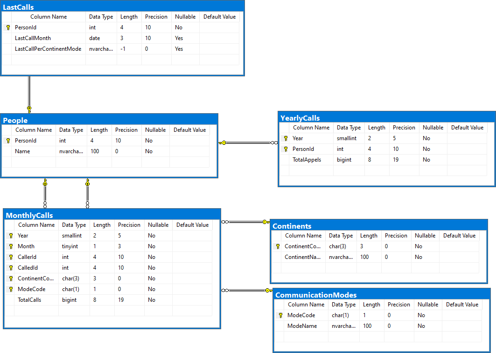

# UT-SQL-CallLogs

UT-SQL-CallLogs is a SQL script that creates a table to store call logs and inserts sample data into it.
It is designed to be used with Microsoft SQL Server Management Studio (SSMS) or any other SQL client that supports T-SQL.

## Schema for current version

## Sample Data

### DEV

> Communication Modes

| ModeCode | ModeName |
| -------- | -------- |
| A        | Analog   |
| D        | Digital  |
| V        | VoIP     |
| X        | X Tech   |

> Continents

| ContinentCode | ContinentName |
| ------------- | ------------- |
| AFR           | Africa        |
| AMN           | North America |
| AMS           | South America |
| ASI           | Asia          |
| EUR           | Europe        |

> People

| PersonId | Name     |
| -------- | -------- |
| 1        | Eula     |
| 2        | Alice    |
| 3        | Bob      |
| 4        | Yoko     |
| 5        | Hans     |
| 6        | Antonio  |
| 7        | Manolita |
| 8        | Michal   |
| 9        | Han      |

> LastCalls

| PersonId | LastCallMonth | LastCallPerContinentMode                    |
| -------- | ------------- | ------------------------------------------- |
| 1        | 2025-05-01    | {"EUR-D":"2025-04-25","ASI-X":"2025-05-01"} |
| 2        | 2025-02-01    | {"EUR-D":"2025-01-15","AMN-V":"2025-02-20"} |
| 3        | 2025-02-01    | {"ASI-A":"2025-02-10"}                      |
| 4        | 2025-04-01    | {"EUR-X":"2025-02-25"}                      |
| 5        | 2025-03-01    | {"AMS-D":"2025-03-15"}                      |
| 6        | 2025-03-01    | {"AFR-V":"2025-03-20"}                      |
| 7        | 2025-04-01    | {"EUR-D":"2025-04-15"}                      |
| 8        | 2025-04-01    | {"AMN-A":"2025-04-10"}                      |
| 9        | 2025-05-01    | {"ASI-X":"2025-05-01"}                      |

> MonthlyCalls

| Year | Month | CallerId | CalledId | ContinentCode | ModeCode | TotalCalls |
| ---- | ----- | -------- | -------- | ------------- | -------- | ---------- |
| 2025 | 1     | 1        | 2        | EUR           | D        | 50         |
| 2025 | 1     | 2        | 3        | AMN           | V        | 100        |
| 2025 | 2     | 3        | 4        | ASI           | A        | 75         |
| 2025 | 2     | 4        | 5        | EUR           | X        | 20         |
| 2025 | 3     | 5        | 6        | AMS           | D        | 60         |
| 2025 | 3     | 6        | 7        | AFR           | V        | 90         |
| 2025 | 4     | 7        | 8        | EUR           | D        | 120        |
| 2025 | 4     | 8        | 9        | AMN           | A        | 30         |
| 2025 | 5     | 9        | 1        | ASI           | X        | 40         |

> YearlyCalls

| Year | PersonId | TotalAppels |
| ---- | -------- | ----------- |
| 2025 | 1        | 1234        |
| 2025 | 2        | 2345        |
| 2025 | 3        | 3456        |
| 2025 | 4        | 4567        |
| 2025 | 5        | 5678        |
| 2025 | 6        | 6789        |
| 2025 | 7        | 7890        |
| 2025 | 8        | 8901        |
| 2025 | 9        | 9012        |
